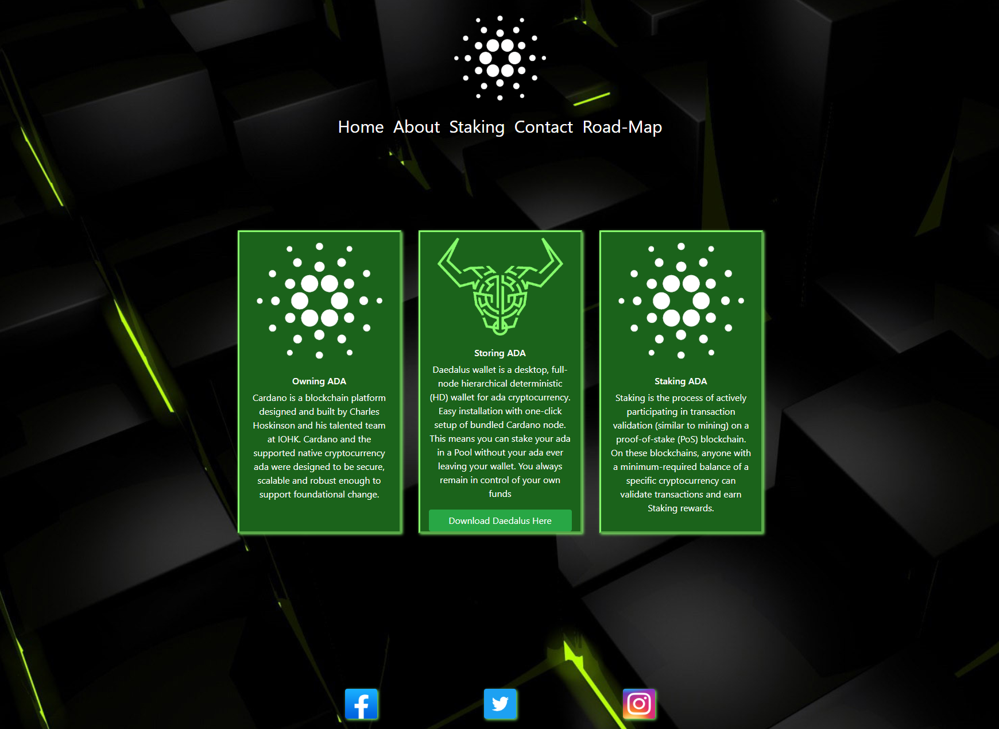

# The-Cardano-Advisor 

*This site is for people to find out more about Cardano a cryptocurrency developed by Charles Hoskinsin which aims to become one of the leading new monetary systems.*

## UX

What users should get from this site is a better understanding of Cardano how it works, the people, how to store their ADA, the companies behind it and what it is trying to acheive within its roadmap. I have found that the information for Cardano is scatter across the web with no site that brings it all together. This should solve that problem for people intreseted in Cardano and who want to get started with it.

## User Stories

### First Time User
a. I want to easily see which sections apply to me.

b. I want to be able to navigate through the website easily.

c. I want to know who developed Cardano.

d. I want to understand what Staking is and how to store the currency.

e. I want to know how to contact someone if I have any questions in relation to ADA.

f. I want to know what the roadmap is and what each stage will bring to the ecosystem.

### Returning User
a. I want to go back over the road-map and see what is coming up next.

b. I want to be able to download the Dadelus wallet if I didn't before.

c. I want to be able to contact someone if I have further questions.

## Features

### Road-Map 
- This should give the user a good understanding of what Cardano is trying to achieve at each milestone.

### Contact Page 
- This will let the client reach out to someone if they have any queries

### Landing Page 
- There are 3 short excerpt boxes giving a brief explenation of the most important parts of Cardano.

### Staking Page 
- There is an in depth explentation of what staking is and how it effects the eco-system of Cardano, here the visitor can also see the price of ADA over 1 week at 1 hourly intervals.

### About Page
- Here the user can read about who the founder is and the different companies all working on the ecosystem.

## Future ideas 

1. Once I have more knowledge in APIs I want to add the count down timer for each block reward.

2. Once I have more Knowledge in Javascript I want to make the time staps into hourly stamps and day.

## Technologies Used

### <a href="https://www.chartjs.org/" target="_blank">ChartJs</a>
- ChartJS used for grapgh on charting page.

### <a href="wireframe/cadanoadvisor.pdf" target="_blank">My Wireframes</a>
- Balsamiq Wireframes.

### <a href="https://fontawesome.com/" target="_blank">Font Awesome</a>
- used for Icons such as in the contact page.

### <a href="https://getbootstrap.com/" target="_blank">Bootstrap</a>
- used for styling website through-out 

### <a href="https://cdnjs.com/" target="_blank">JavaScript CDN</a>
- used for collapse of navbar and hamburger icon on mobile.

### <a href="https://www.coingecko.com/en/api" target="_blank">CoinGecko API</a>
- used for the price graph on the staking page.

### <a href="https://www.emailjs.com/" target="_blank">EmailJS</a>
- used for the contact page to send emails.

## Testing

- <a href="https://esprima.org/demo/validate.html" target="_blank">syntax Validator</a>

- <a href="https://jigsaw.w3.org/css-validator/#validate_by_input" target="_blank">W3C Markup Validator</a>

- <a href="https://validator.w3.org/" target="_blank">W3c Markup Validator (HTML)</a>

## First Time User

 ### I want to easily see which sections apply to me.

a. Upon entering the site, users are automatically greeted with a clean and easily readable navigation bar to go to the page of their choice. Underneath there are 3 sections which briefly outline the most relvant parts about Cardano to a new user.

b. The main points are easily understood and brief to hold the users attention.

c. The user has two options, either use the navigation bar or click on one of the images.

 ### I want to be able to navigate through the website easily.

a. The site has been designed to be very visually appealing however not distracting. The user can use the navigation bar to take them to the desired section of the website. 
	
 ### I want to understand what Staking is and how to store the currency.

a. Once the user wants to know more about staking they hit the staking part of the nav bar.

b. In this page there is a good description about staking and how it works with the Cardano ecosystem.

c. The user is also presented with a 7 day price chart of the price of day per hour.

 ### I want to be able to see what past users of this company thought of the experience.

a. On the Home Page the user can see previous testimonials from past clients.

 ### I want to know how to contact someone if I have any questions in relation to ADA.
 
a. Within the navigation bar there is a link to the contact page so users can contact someone with any questions they may have.

c. Within the footer of each page, there are links to social media sites in the cardano community.

### I want to know what the roadmap is and what each stage will bring to the ecosystem.

a. On the roadmap section of the site there are 5 pictures which are color cordinated when you hover over them showing that they can be clicked. Each Picture will bring up information about that stage and what it will bring to the Cardano ecosystem.

## Returning Users

 ### I want to go back over the road-map and see what is coming up next

a. The user can go to the roadmap section and go back over the section they want to read.

 ### I want to be able to download the Dadelus wallet if I didn't before.

a. After reading about Cardano and thinking about what it can offer the user can come back to the main page of the site and choose to download the exe to for the Daedalus wallet via the offical page.

 ### I want to be able to contact someone if I have further questions.

a. The user can go to the contact page where they will provide a name and email address then a brief message of what they want help with. This will send an email to the assigned email address using email JS with the details.

## Additional Testing

- The Website was tested on Google Chrome, Internet Explorer, Microsoft Edge and Safari browsers.
- The website was viewed on a variety of devices such as Desktop, Laptop, samsung.
- A large amount of testing was done to ensure that all pages were linking correctly.
- Friends and family members were asked to review the site to point out any bugs and/or user experience issues.
- When using the Road-map extensive testing was done to try and break the sequence. Code does not break no matter the sequence of clicks.

### Contact form 

- Try to submit the empty form and verify that an error message about the required fields appears.

## Deployment

GitHub Pages
- The project was deployed to GitHub Pages using the following steps...

1. Log in to GitHub and locate the GitHub Repository

2. At the top of the Repository (not top of page), locate the "Settings" button on the menu.

3. Scroll down the Settings page until you locate the "GitHub Pages" Section.

4. Under "Source", click the dropdown called "None" and select "Master Branch".

5. The page will automatically refresh.

6. Scroll back down through the page to locate the now published site link in the "GitHub Pages" section.

 ### Pushing To GitHub
 
- Committing every few lines of code. 

- Pushing the code to Github at the end of each writing session. 

## Credits

- Idea for charting and to use ChartJs came from a youtube tutorial quoted in graph.js

- BackGround Image was taken from https://wallpapersafari.com/w/OyqRBE

- All information on the road-map structure/info/pictures were taken from https://roadmap.cardano.org/en/byron/

- Information for staking page came from https://www.cardanofoundation.org/en/news/shelley-is-here-the-cardano-blockchain-undergoes-a-historic-hard-fork/

- All information on the about section was taken from https://cardano.org/discover-cardano/
